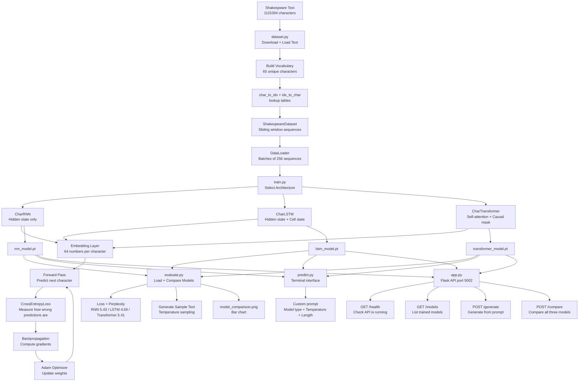

```mermaid
flowchart TD
    A[Shakespeare Text\n1115394 characters] --> B[dataset.py\nDownload + Load Text]
    B --> C[Build Vocabulary\n65 unique characters]
    C --> D[char_to_idx + idx_to_char\nlookup tables]
    D --> E[ShakespeareDataset\nSliding window sequences]
    E --> F[DataLoader\nBatches of 256 sequences]

    F --> G[train.py\nSelect Architecture]

    G --> H1[CharRNN\nHidden state only]
    G --> H2[CharLSTM\nHidden state + Cell state]
    G --> H3[CharTransformer\nSelf-attention + Causal mask]

    H1 --> I[Embedding Layer\n64 numbers per character]
    H2 --> I
    H3 --> I

    I --> J[Forward Pass\nPredict next character]
    J --> K[CrossEntropyLoss\nMeasure how wrong predictions are]
    K --> L[Backpropagation\nCompute gradients]
    L --> M[Adam Optimizer\nUpdate weights]
    M --> J

    H1 --> N1[rnn_model.pt]
    H2 --> N2[lstm_model.pt]
    H3 --> N3[transformer_model.pt]

    N1 --> O[evaluate.py\nLoad + Compare Models]
    N2 --> O
    N3 --> O

    O --> P[Loss + Perplexity\nRNN 5.43 / LSTM 4.69 / Transformer 5.41]
    O --> Q[Generate Sample Text\nTemperature sampling]
    O --> R[model_comparison.png\nBar chart]

    N1 --> S[predict.py\nTerminal interface]
    N2 --> S
    N3 --> S

    S --> T[Custom prompt\nModel type + Temperature + Length]

    N1 --> U[app.py\nFlask API port 5002]
    N2 --> U
    N3 --> U

    U --> V1[GET /health\nCheck API is running]
    U --> V2[GET /models\nList trained models]
    U --> V3[POST /generate\nGenerate from prompt]
    U --> V4[POST /compare\nCompare all three models]
```
